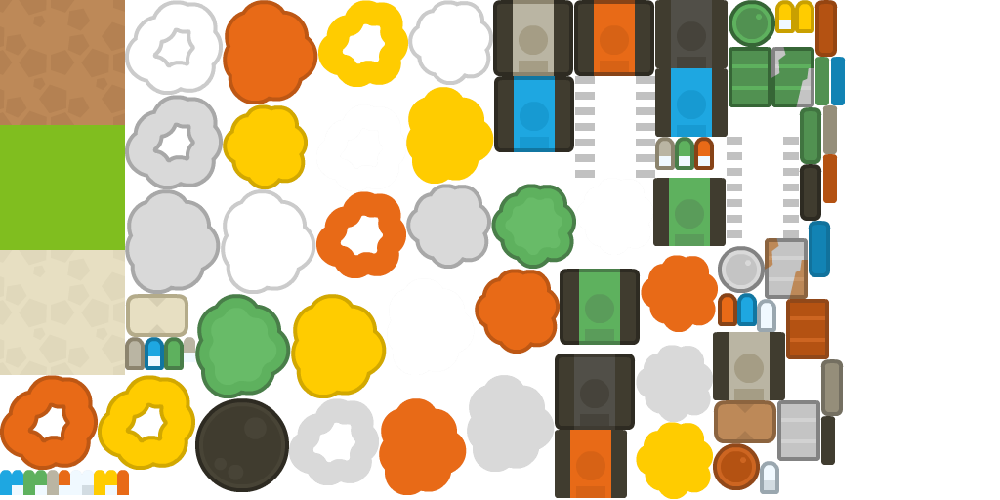

# UVEC2021
Programing Project for UVEC 2021
## UI Mock-up/demo

## About
Our player-controlled tank project is based on Unity which allows two players to move tanks around using forces. Players can just simply shoot the enemy tanks, however, they get hurt by their own bullets too, so watch out! 

## Getting Started

1. Clone the repository
2. Install Unity Hub (if you haven't already)
3. Install VSCode (if you haven't already)
4. Navigate to the root directory of the project
5. Open the executable file, and click the .exe file to play

## Project Description
The project Description can be found here:
https://docs.google.com/document/d/1S8wUiZ8FWZDZlACiqAm2LgoGmAjDhL6F/edit?usp=sharing&ouid=103997961482562331451&rtpof=true&sd=true

